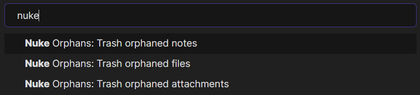
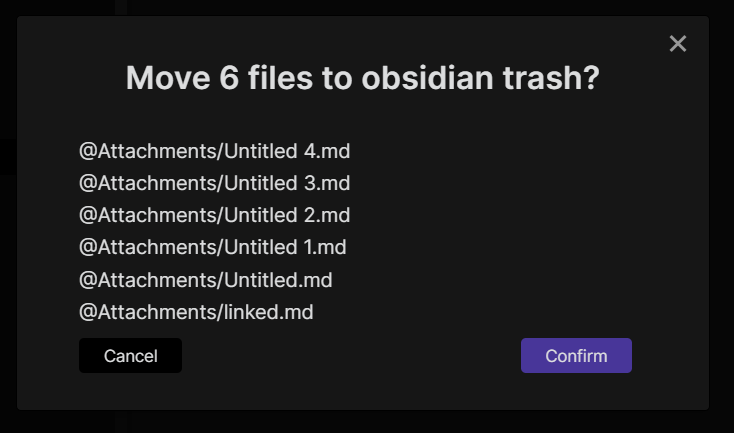

# Nuke Orphans Obsidian Plugin
Simple plugin that trashes orphaned attachments (or all files) using a command

## [KISS](https://en.wikipedia.org/wiki/KISS_principle)
The plugin provides three commands which can be ran from command palette *(default keybinding is `Ctrl + P`)*

**The plugin will always ask you before trashing files**\

## Installation
### Manual
Download latest plugin archive from [here](https://github.com/sandorex/nuke-orphans-plugin/releases/latest/download/nuke-orphans.zip) and extract into `.obsidian/plugin/`

Alternatively you can manually download [`main.js`](https://github.com/sandorex/nuke-orphans-plugin/releases/latest/download/main.js), [`manifest.json`](https://github.com/sandorex/nuke-orphans-plugin/releases/latest/download/manifest.json) and [`styles.css`](https://github.com/sandorex/nuke-orphans-plugin/releases/latest/download/styles.css) and copy them into `.obsidian/plugin/nuke-orphans/`
